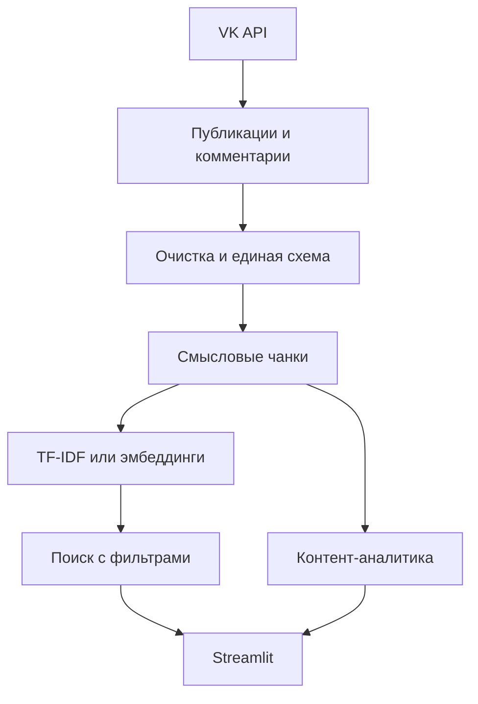

# Ikanam: поиск и аналитика контента

Командный учебный проект по созданию поискового корпуса из публикаций и
комментариев сообщества. Данные собираются через VK API, очищаются, делятся на
смысловые фрагменты и используются в интерактивном Streamlit-дашборде.
Проект не является официальным сервисом сообщества.

Репозиторий называется `content-search-and-analytics`, а не RAG: текущая версия
ищет релевантные фрагменты, но не генерирует ответ с помощью языковой модели.
Это осознанное ограничение и честное описание реализованной функциональности.

## Задача

За несколько лет в сообществе накопились публикации, статьи и обсуждения.
Обычный поиск по ключевому слову не всегда находит материалы с похожим смыслом.
Нужен воспроизводимый процесс, который:

1. собирает тексты и метаданные;
2. сохраняет публикации и комментарии раздельно;
3. очищает и структурирует корпус;
4. строит поиск по смысловым фрагментам;
5. показывает динамику и состав контента.

## Что реализовано

- постраничный сбор публикаций и всех доступных комментариев через VK API;
- очистка HTML, ссылок, повторных пробелов и технических заглушек;
- отдельные строки и даты для комментариев;
- деление текста по границам предложений с настраиваемым перекрытием;
- семантический поиск по русскоязычным текстам на
  `intfloat/multilingual-e5-small`;
- быстрый TF-IDF-режим для запуска без загрузки модели;
- фильтрация поиска по году и типу контента;
- интерактивный дашборд с динамикой публикаций и частотными словами;
- безопасная конфигурация токена через `.env`;
- синтетический демо-набор вместо публикации полного массива комментариев;
- тесты для очистки, чанкинга и фильтрации поиска.

## Результат исходного исследования

Снимок данных, использованный в университетской версии проекта:

| Показатель | Значение |
|---|---:|
| Период | октябрь 2016 — май 2025 |
| Уникальные публикации из VK | 1 036 |
| Собранные комментарии | 2 559 |
| Документы после объединения со статьями | 1 044 |
| Документы, давшие непустые чанки | 851 |
| Текстовые чанки | 2 816 |

Числа относятся к конкретному снимку данных и могут измениться при повторном
сборе.

## Мой вклад

Проект выполнялся в команде. Я отвечала за:

- очистку и подготовку текстовых данных;
- выбор стратегии деления текста на чанки;
- выбор модели эмбеддингов;
- заполнение поискового хранилища;
- участие в разработке дашбордов;
- анализ и прогнозирование показателей активности сообщества.

В портфолио-версии также переработаны структура данных, воспроизводимость
pipeline, конфигурация и логика поиска.

## Как устроен проект



## Быстрый запуск на Mac

```bash
git clone <repository-url>
cd ikanam-content-search-and-analytics

python3 -m venv .venv
source .venv/bin/activate
python -m pip install -r requirements.txt

streamlit run app.py
```

Приложение автоматически откроет синтетический демо-набор. Токен для этого не
нужен.

## Полный pipeline

Создать локальный файл с токеном:

```bash
cp .env.example .env
```

Добавить в `.env` собственный `VK_API_TOKEN`, затем выполнить:

```bash
python scripts/collect_vk.py --group ikanam
python scripts/build_corpus.py
streamlit run app.py
```

Чтобы включить семантический поиск:

```bash
python -m pip install -r requirements-semantic.txt
python scripts/build_index.py
streamlit run app.py
```

Если артефактов модели нет, дашборд использует TF-IDF. Для корпуса из нескольких
тысяч чанков точный расчёт cosine similarity после фильтрации достаточно быстрый
и гарантирует, что результаты соответствуют выбранным годам и типам контента.

## Структура

```text
.
├── app.py                       # Streamlit-дашборд
├── scripts/
│   ├── collect_vk.py            # сбор данных через API
│   ├── build_corpus.py          # очистка и чанкинг
│   └── build_index.py           # эмбеддинги и FAISS-индекс
├── src/ikanam_analytics/
│   ├── vk_client.py
│   ├── preprocessing.py
│   ├── corpus.py
│   ├── chunking.py
│   └── search.py
├── data/
│   ├── sample/                  # синтетическое демо
│   ├── raw/                     # локальные исходные данные
│   └── processed/               # локальные результаты
├── artifacts/                   # локальный индекс и эмбеддинги
├── tests/
└── docs/
```

## Проверка

```bash
python -m unittest discover -s tests -v
```

## Ограничения

- через API собираются доступные верхнеуровневые комментарии; ответы внутри
  веток пока не раскрываются;
- тексты статей, которые нельзя получить через используемый метод API, нужно
  передать отдельным CSV;
- качество поиска ещё не оценено на размеченном наборе запросов;
- генерация итогового ответа не реализована, поэтому проект не заявляется как
  полноценная RAG-система;
- полный корпус и эмбеддинги не публикуются в репозитории.

Следующий содержательный шаг — подготовить 30–50 тестовых запросов, вручную
разметить релевантные результаты и сравнить TF-IDF с мультиязычными
эмбеддингами по `Precision@k` и `MRR`.

Подробнее о данных: [data/README.md](data/README.md).  
Краткий разбор для собеседования: [docs/project_story.md](docs/project_story.md).  
Инструкция по публикации: [docs/github_upload.md](docs/github_upload.md).
